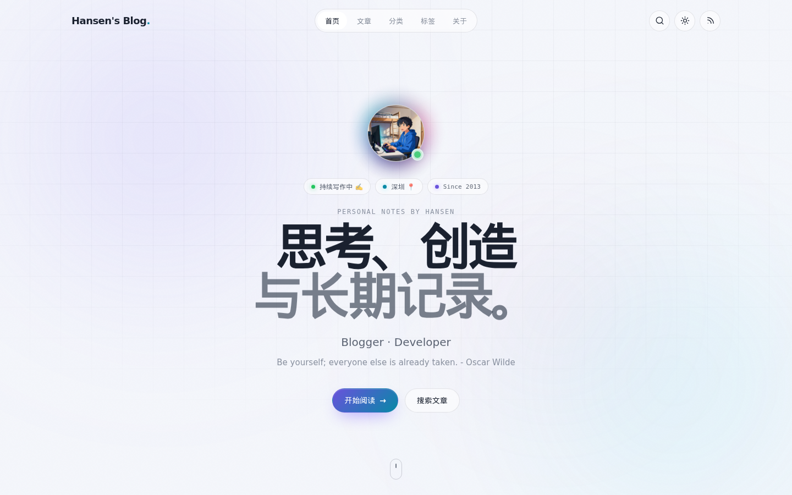
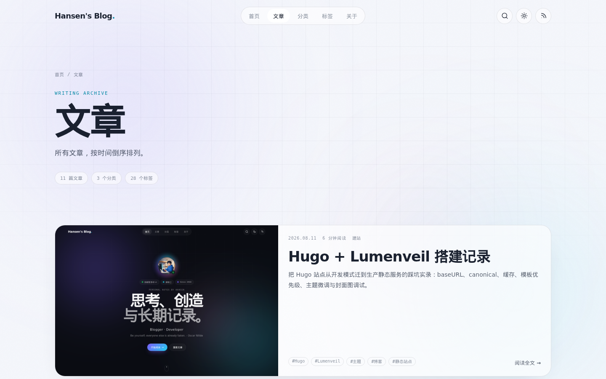
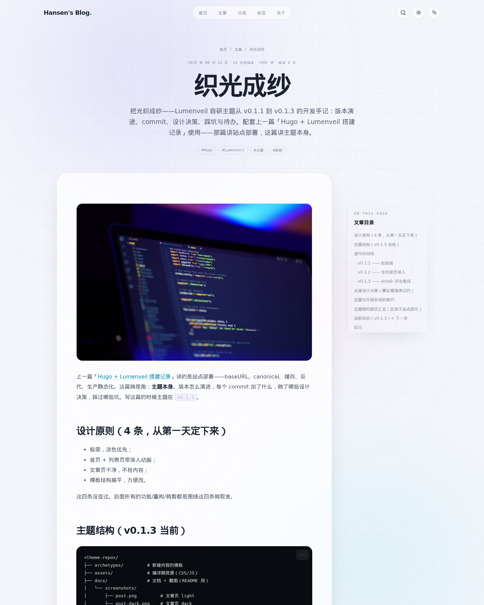
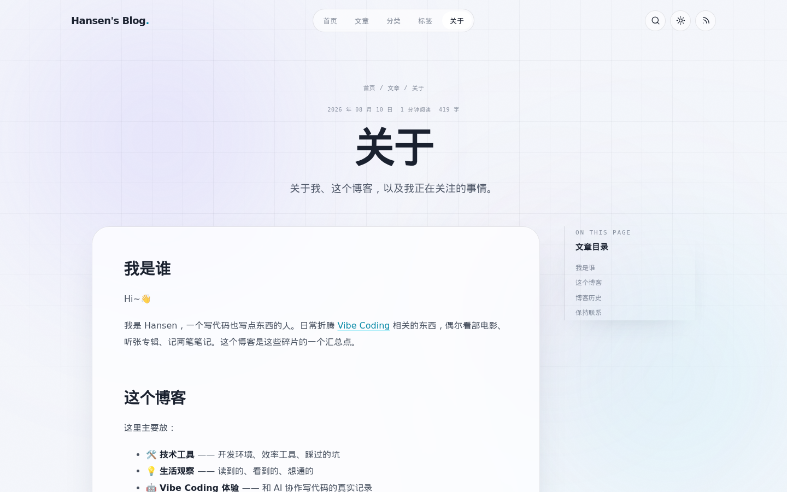
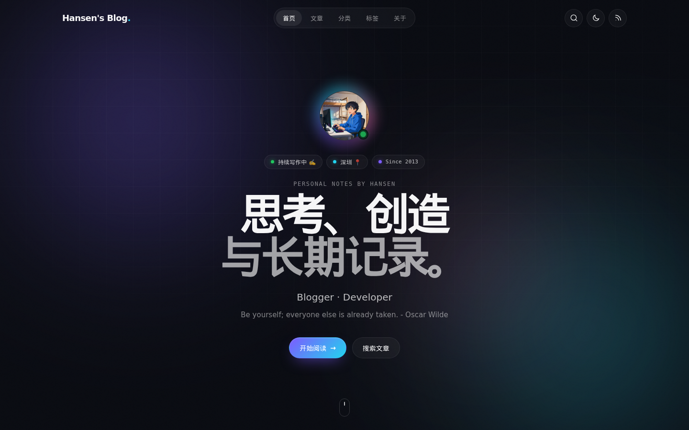
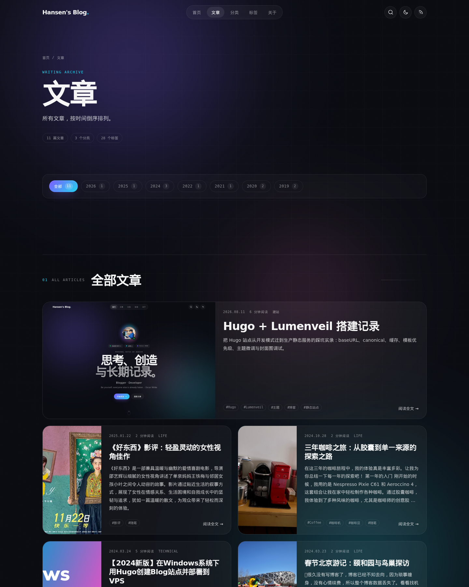
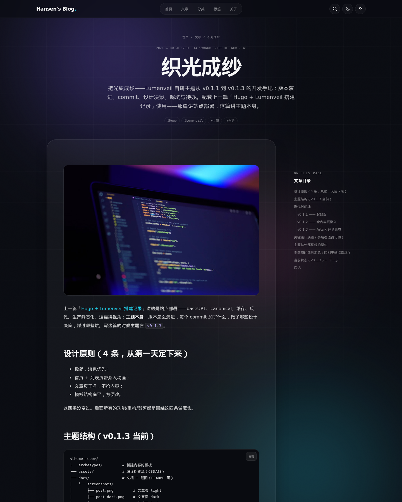
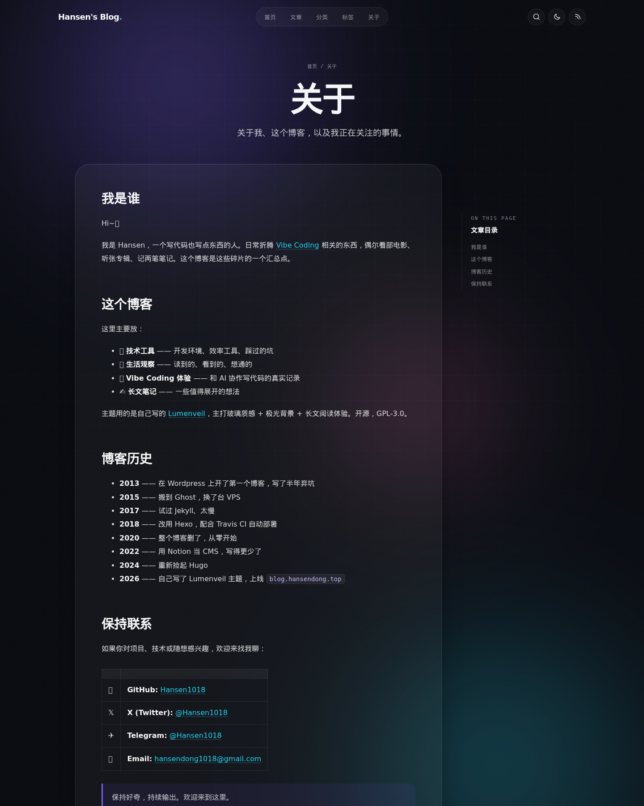

# Lumenveil

A luminous, responsive Hugo theme with glass surfaces, aurora ambience, automatic light and dark modes, search, galleries, and a reading-first experience for long-form content.

[中文说明](README.zh.md) · [English](#english) · [Screenshots](#screenshots)

## Screenshots

Live preview: <https://blog.hansendong.top>

### Light mode

| Home | Articles |
| --- | --- |
|  |  |

| Article | About |
| --- | --- |
|  |  |

### Dark mode

| Home | Articles |
| --- | --- |
|  |  |

| Article | About |
| --- | --- |
|  |  |

## English

### Features

- Responsive home, archive, category, tag, article, gallery, and 404 layouts
- Aurora background, glassmorphism surfaces, and full-bleed cover support
- Automatic light and dark mode with a persistent manual switch
- Client-side search powered by Hugo JSON output
- Categories, tags, pagination, RSS, sitemap, and robots.txt
- Article table of contents, reading time, word count, last modified indicator, and a real-time cross-user page view count via the busuanzi partial (third-party CN service)
- Dynamic copyright range (from `since` to the current year) and CC BY-NC-SA 4.0 license badge in the footer
- Syntax highlighting and one-click code or article-link copy
- PhotoSwipe-powered image gallery shortcode with a CSS grid layout
- Optional Artalk comments module — config-driven partial that mirrors the article card style (glass, button--ghost, mono uppercase header) and auto-aligns to `.article-main` via the existing CSS grid
- Optional `cover` front matter per post — page-bundle image or `static/` asset, used as the archive-page thumbnail
- Open Graph, Twitter Card, canonical URL, and JSON-LD metadata
- Reduced-motion support, keyboard focus states, and mobile navigation
- Hugo Pipes minification and asset fingerprinting

### Requirements

- Hugo Extended `0.146.0` or newer
- Git, if installing as a submodule

### Installation

From the root of your Hugo site:

```bash
git submodule add https://github.com/Hansen1018/hugo-theme-lumenveil.git themes/lumenveil
```

Enable the theme in `hugo.toml`:

```toml
theme = 'lumenveil'
```

Update the theme later with:

```bash
git submodule update --remote --merge
```

### Required configuration

Search requires a JSON output for the home page. Copy the following into your site's `hugo.toml` and adjust the values to match your project:

```toml
locale = 'zh-cn'
defaultContentLanguage = 'zh-cn'
hasCJKLanguage = true
enableRobotsTXT = true

[pagination]
  pagerSize = 8

[taxonomies]
  category = 'categories'
  tag = 'tags'

[outputs]
  home = ['HTML', 'RSS', 'JSON']
  section = ['HTML', 'RSS']
  taxonomy = ['HTML', 'RSS']
  term = ['HTML', 'RSS']

[outputFormats.JSON]
  mediaType = 'application/json'
  baseName = 'index'
  isPlainText = true
  notAlternative = true

[markup]
  [markup.highlight]
    noClasses = false
    guessSyntax = true
  [markup.tableOfContents]
    startLevel = 2
    endLevel = 4
    ordered = false

[params]
  description = 'Notes on technology, life, and long-term thinking.'
  author = 'Your Name'
  initial = 'Y'
  avatar = '/images/avatar.png'
  role = 'Writer · Developer'
  tagline = 'A short sentence about you and your writing.'
  location = 'Your City'
  status = 'Currently writing'
  email = 'you@example.com'
  github = 'https://github.com/yourname'
  twitter = 'https://twitter.com/yourname'
  since = 2024
  mainSections = ['posts']

[menus]
  [[menus.main]]
    name = 'Home'
    pageRef = '/'
    weight = 10
  [[menus.main]]
    name = 'Posts'
    pageRef = '/posts'
    weight = 20
  [[menus.main]]
    name = 'About'
    pageRef = '/about'
    weight = 25
  [[menus.main]]
    name = 'Categories'
    pageRef = '/categories'
    weight = 30
  [[menus.main]]
    name = 'Tags'
    pageRef = '/tags'
    weight = 40
```

### Content structure

```text
content/
├── _index.md
├── about.md
├── posts/
│   ├── _index.md
│   └── hello-world.md
├── categories/
│   └── _index.md
└── tags/
    └── _index.md
```

Example article front matter:

```yaml
---
title: "Hello World"
date: 2026-08-10T10:00:00+08:00
lastmod: 2026-08-15T18:30:00+08:00
draft: false
description: "A short summary displayed in article cards and metadata."
categories: ["Notes"]
tags: ["Hugo", "Writing"]
cover: "images/hello-world.jpg"   # optional; falls back to a static/ asset when no page-bundle image matches
toc: true
---
```

`lastmod` is optional. When present and later than `date`, a "Last updated …" line is rendered in the article header (the template uses a localized label, so the rendered text matches the site's language).

`cover` is optional. When set, it shows up as the post-card thumbnail on the archives page. The value is first looked up as a page-bundle resource, then falls back to a path under `static/` (e.g. `cover: images/foo.png` resolves to `/images/foo.png`).

### Image gallery shortcode

Drop one or more images into a directory, then use the shortcode by folder name:

```md

```

The shortcode renders a responsive CSS grid and uses PhotoSwipe for full-screen previews. Images are served as-is from `static/`.

### Run locally

```bash
hugo server -D
```

Open `http://localhost:1313/` in your browser.

### Customization

- Edit site identity, social links, and license year under `[params]`.
- Replace `static/favicon.svg` and `static/og.svg` with your own brand assets.
- Override any theme file by creating the same path in your site's `layouts`, `assets`, or `static` directory.
- The theme follows the system color preference by default. A visitor's manual selection is stored locally in the browser.

For the Chinese translation, see [README.zh.md](README.zh.md).

## License

Lumenveil is released under the [GNU General Public License v3.0](LICENSE). The default site footer links to the [CC BY-NC-SA 4.0](https://creativecommons.org/licenses/by-nc-sa/4.0/deed.zh-hans) license for the site's written content; you can replace it with the license that suits your work.
