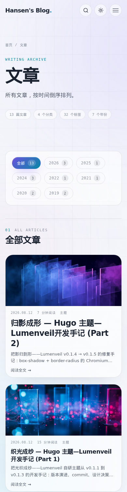
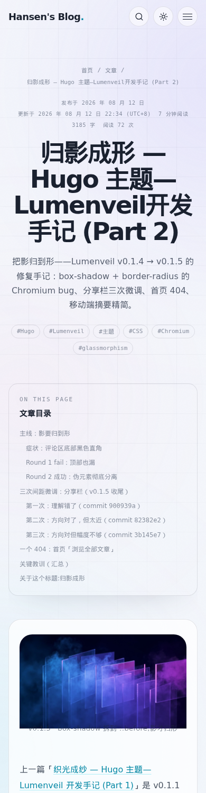
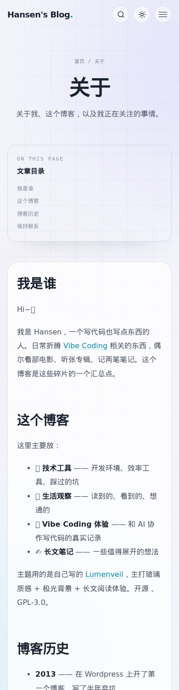
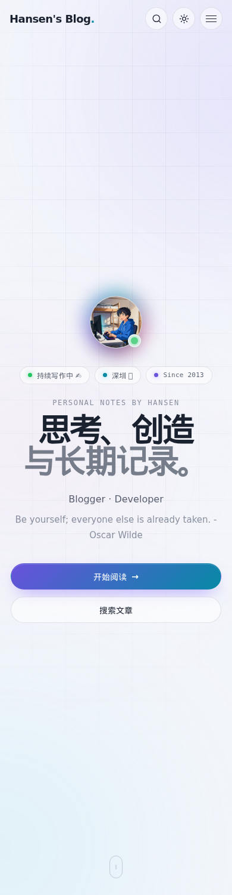
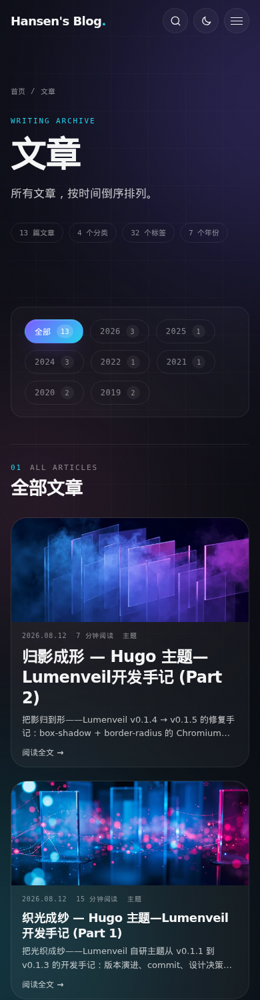
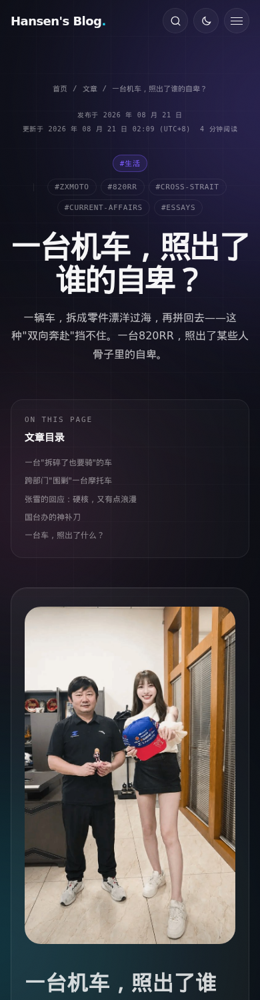
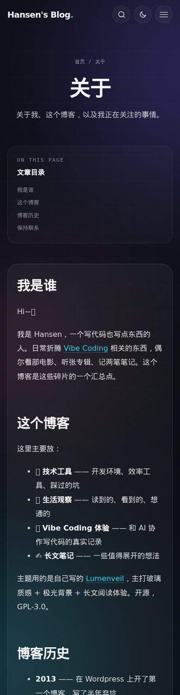

# Lumenveil（光幕）

[](https://github.com/Hansen1018/hugo-theme-lumenveil/stargazers) [](https://github.com/Hansen1018/hugo-theme-lumenveil/releases) [](https://github.com/Hansen1018/hugo-theme-lumenveil/blob/main/LICENSE) [](https://t.me/Hansen1018)

[](https://ko-fi.com/K3N525V491)

A luminous, responsive Hugo theme with glass surfaces, aurora ambience, automatic light and dark modes, search, galleries, and a reading-first experience for long-form content.

[English](README.md) · [中文说明](#lumenveil光幕) · [Screenshots](#截图)

Lumenveil（光幕）是一款面向个人博客的 Hugo 主题，以通透玻璃表面、柔和极光背景和舒适长文阅读为核心，并提供完整的浅色与深色模式。

在线预览：<https://blog.hansendong.top>

## 截图
### 浅色模式
| 首页 | 文章列表 |
| --- | --- |
|  |  |

| 文章页 | 关于页 |
| --- | --- |
|  |  |
### 深色模式
| 首页 | 文章列表 |
| --- | --- |
|  |  |

| 文章页 | 关于页 |
| --- | --- |
|  | 
### 移动端
| 首页 | 文章列表 |
| --- | --- |
|  |  |

| 文章页 | 关于页 |
| --- | --- |
|  |  |

| 首页（深色） | 文章列表（深色） |
| --- | --- |
|  |  |

| 文章页（深色） | 关于页（深色） |
| --- | --- |
|  |  |
## 主要功能

- 首页、文章归档、分类、标签、正文、相册与 404 页面
- **文章头同时显示分类与标签** —— 分类和标签药丸并排渲染；分类标签从 term 页 `.Title` 解析显示文字（如 slug `webdev` 显示 `建站`），实现「英文 URL slug + 中文显示」无需逐个改主题。fallback 顺序：硬编码 `webdev → 建站` → 原始 slug。移动端（`@media (max-width: 760px)`）将分类放在第 1 行、标签放第 2 行，每行 `flex: 1 1 100%`。
- **Friends 页面零配置样式** —— 在 `content/friends/` 放下 page bundle，主题自动渲染完整样式页（信息卡片含 eyebrow 药丸 + 渐变 accent 条 + `dl` 信息表 + 5/4/3/2 列响应式 friend-card 网格 + violet→cyan 渐变 hover + 头像青色光晕 + dashed 空状态）。样式在 `assets/css/components/friends.css`。
- 极光背景、玻璃卡片、封面图全幅展示
- 自动跟随系统的浅色/深色模式，并记忆手动选择
- 基于 Hugo JSON 输出的前端全文搜索
- 分类、标签、分页、RSS、站点地图与 robots.txt
- 文章目录、阅读时间、字数统计、最后更新时间与通过 busuanzi partial 显示的实时跨访客阅读次数（第三方 CN 服务）
- 页脚动态版权（`since` 至今）和 CC BY-NC-SA 4.0 许可链接
- 代码高亮、代码复制与文章链接复制
- **Opt-in 客户端语法高亮（`[params] highlight = 'hljs'`）** —— 设置后主题加载 highlight.js + monokai，并通过 `.hljs { background: transparent !important }` 让容器融入文章底色。`_default/_markup/render-codeblock.html` 输出原始 `<pre><code>`（无 chroma span），hljs 不会重复标记。未设置该参数时零变更 —— 不主动发 chroma 字节。
- 由 PhotoSwipe 驱动的相册 shortcode，使用 CSS 网格布局
- 可选的 Artalk 评论模块 —— 配置驱动的 partial，样式与文章卡片对齐（玻璃卡片、按钮--ghost 等），自动通过现有 CSS Grid 与 .article-main 列对齐，并在评论列表加载时加入逐条 stagger fade-in
- 可选的 `cover` 封面图 — 支持 page-bundle 图片（通过 `Resources.GetMatch` 解析）或 `static/` 静态资源，在文章列表中作为缩略图展示，**并作为 `og:image` / `twitter:image` meta 标签用于社交分享**（未设置时 fallback 到 `/og.svg` —— 带前导 `/` 的路径或 page-bundle 资源会解析到真实 permalink）
- 可选的 `cover_caption` 封面图说明 —— 设置后在封面图下方渲染深色玻璃药丸（`rgba(15,23,42,.72)` + `border: 1px solid rgba(255,255,255,.08)` + `border-radius: 999px` + `backdrop-filter: blur(8px)` + 近白文字），白底封面也能看清。默认空 → 不渲染 `<figcaption>`。
- Open Graph、Twitter Card、Canonical 和 JSON-LD
- 响应式导航、键盘焦点和减少动态效果支持
- Hugo Pipes 自动压缩与资源指纹

## 安装

在 Hugo 站点根目录执行：

```bash
git submodule add https://github.com/Hansen1018/hugo-theme-lumenveil.git themes/lumenveil
```

然后在 `hugo.toml` 中启用：

```toml
theme = 'lumenveil'
```

搜索功能依赖首页 JSON 输出，请按需复制 [README.md](README.md#required-configuration) 中 *Required configuration* 章节的完整 `hugo.toml` 示例，并修改其中的 `[params]` 与菜单内容。

## 新建文章

```bash
hugo new content posts/my-first-post.md
hugo server -D
```

主题自带文章原型。发布前将文章 Front Matter 中的 `draft` 改为 `false`。

示例 Front Matter：

```yaml
---
title: "你好世界"
date: 2026-08-10T10:00:00+08:00
lastmod: 2026-08-15T18:30:00+08:00
draft: false
description: "摘要，会在文章卡片和 meta 区域显示。"
categories: ["笔记"]
tags: ["Hugo", "写作"]
cover: "images/hello-world.jpg"   # 可选；首先查 page-bundle 资源，找不到时 fallback 到 static/ 路径
cover_caption: ""   # 可选；封面图下方的深色玻璃药丸说明，白底封面也能看清
toc: true
---
```

`cover` 可选。设置后会在归档列表页作为文章卡片缩略图，同时作为 `og:image` / `twitter:image` meta 标签用于社交分享（Twitter、Facebook、Discord、Slack 预览）。值先通过 `Resources.GetMatch` 查 page-bundle 资源，找不到时 fallback 到 `static/` 下的路径（例如 `cover: images/foo.png` 解析为 `/images/foo.png`）；无前导 `/` 的相对路径会自动补前导。未设置 `cover` 时 fallback 到 `/og.svg`。

`cover_caption` 可选。设置后在封面图下方以深色玻璃药丸渲染（由 `.article-cover figcaption { text-align: center }` 居中）。留空则不渲染 `<figcaption>`。

## 相册 shortcode

将图片放入 `static/gallery/<name>/` 目录，然后在文章中：

```md

```

短代码会渲染响应式 CSS 网格，并使用 PhotoSwipe 提供大图浏览。
### CSS 组件架构

`layouts/_partials/head.html` 在 build 时把每个组件文件按 cascade 顺序显式列在 slice 里，再用 `resources.Concat` 打包成一个 minified + fingerprinted 的 `main.css`：

```go
{{ $components := slice
    (resources.Get "css/components/tokens.css")
    (resources.Get "css/components/reset.css")
    (resources.Get "css/components/utilities.css")
    (resources.Get "css/components/aurora.css")
    (resources.Get "css/components/header.css")
    (resources.Get "css/components/home.css")
    (resources.Get "css/components/page-hero.css")
    (resources.Get "css/components/pagination.css")
    (resources.Get "css/components/gallery-prose.css")
    (resources.Get "css/components/photoswipe.css")
    (resources.Get "css/components/term.css")
    (resources.Get "css/components/article.css")
    (resources.Get "css/components/like.css")
    (resources.Get "css/components/archive.css")
    (resources.Get "css/components/toc.css")
    (resources.Get "css/components/404.css")
    (resources.Get "css/components/search.css")
    (resources.Get "css/components/footer.css")
    (resources.Get "css/components/back-to-top.css")
    (resources.Get "css/components/responsive.css")
    (resources.Get "css/components/motion.css")
    (resources.Get "css/components/theme-light.css")
    (resources.Get "css/components/gallery.css")
}}
{{ $main := $components | resources.Concat "css/main.css" | minify | fingerprint }}
```

同样的 cascade 顺序在 `head.html` 顶部有一段编号注释，两边对得上。

`assets/css/main.css`（685 行，拆分前的 monolithic 源文件）保留作为 **canonical 参考**，不是站点实际服务的资源——build pipeline 会忽略它，从上面那个 slice 重新生成 `main.css`。

**为什么不用 `resources.Match`？** 之前的实现用过 `resources.Match "css/components/_*.css" | resources.Concat`，靠 ASCII 排序（下划线前缀）维持 cascade 顺序。这是不对的：`resources.Match` 返回的文件是按 **字母** 排，不是按 CSS cascade 排，结果真出了 bug——`_tokens.css` 跑到组件文件 *后面*，CSS 变量在下游被重新定义而不是上游先准备好，desktop 布局直接崩了（≈980px 的页面居中而不是填满 viewport）。修法就是按 cascade 顺序在 slice 里显式列出来，让 `resources.Concat` 按声明顺序拼接。所以加组件是个两步显式编辑（文件 + slice + 注释），不是 Match 自动拾起。

24 个组件按 cascade 顺序：

| # | 文件 | BEM 前缀 | 内容 |
| --- | --- | --- | --- |
| 1 | `tokens.css` | (root vars) | `:root` 自定义属性 |
| 2 | `reset.css` | (global) | `*, html, body, a, button, img, ::selection, :focus-visible, ::-webkit-scrollbar` |
| 3 | `utilities.css` | (global) | `.sr-only, .skip-link, .glass, .glass::before, .site-shell` |
| 4 | `aurora.css` | `.aurora, .aurora__*` | 背景画布、光斑、drift 动画 |
| 5 | `header.css` | `.site-header, .brand, .main-nav, .icon-button, .menu-toggle, .header-actions` | 顶部导航 |
| 6 | `home.css` | `.hero, .hero__*, .chip, .button, .fade-up, .explore-panel, .about-panel` | 首页/hero |
| 7 | `page-hero.css` | `.page-hero, .page-hero__stats, .breadcrumbs, .empty-state, .eyebrow` | section 框架 |
| 8 | `pagination.css` | `.pagination, .pagination-item, .pagination-pages` | 分页 |
| 9 | `gallery-prose.css` | `.pswp-figure, .pswp-inline, figcaption` | `.prose` 内联图片 reset |
| 10 | `photoswipe.css` | `.pswp__bg, .pswp__container, .pswp__item, .pswp__img` | PhotoSwipe 覆盖 |
| 11 | `term.css` | `.term-grid, .term-card` | 分类列表 |
| 12 | `article.css` | `.article, .article-header, .article-cover, .prose, .copy-code` | 文章正文 |
| 13 | `like.css` | `.article-like, .like-btn, .like-icon, .like-count` | 文章点赞 CTA |
| 14 | `archive.css` | `.archive-board, .archive-block, .archive-count, .archive-empty` | archive 页 |
| 15 | `toc.css` | `.toc, .toc__inner` | TOC 侧边栏 |
| 16 | `404.css` | `.not-found, .not-found__*, .suggest-card` | 404 页 |
| 17 | `search.css` | `.search-dialog, .search-field, .search-result, .search-empty, kbd` | 搜索弹窗 |
| 18 | `footer.css` | `.site-footer, .footer-inner, .footer-bottom, .footer-links` | footer |
| 19 | `back-to-top.css` | `.back-to-top` | 返回顶部按钮 |
| 20 | `responsive.css` | (media queries) | 断点覆盖 |
| 21 | `motion.css` | (media queries) | `prefers-reduced-motion` 覆盖 |
| 22 | `theme-light.css` | `html[data-theme="light"] *` | 浅色主题覆盖 |
| 23 | `gallery.css` | `.gallery, .gallery__*, .pswp-gallery, .pswp-item` | gallery shortcode |
| 24 | `douban-card.css` | `.douban-card, .douban-card__*` | douban-card 短代码 |

**添加新组件**：

1. 新建 `assets/css/components/<name>.css`，按 BEM 命名。选好 cascade 位置（variables → reset → utilities → chrome → page-specific → overrides）。
2. 在 `head.html` 的 slice 末尾 append，并在顶部编号注释里同步加一行。如果 `resources.Get` 路径不存在，build 会直接失败。
3. 重新构建：`hugo server -D`。

## 许可

Lumenveil 主题以 [GNU General Public License v3.0](LICENSE) 发布。站点默认页脚的 CC BY-NC-SA 4.0 链接用于站点文字内容，请按需要替换为适合你的许可协议。